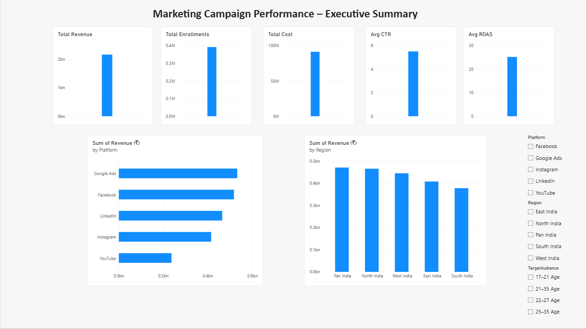
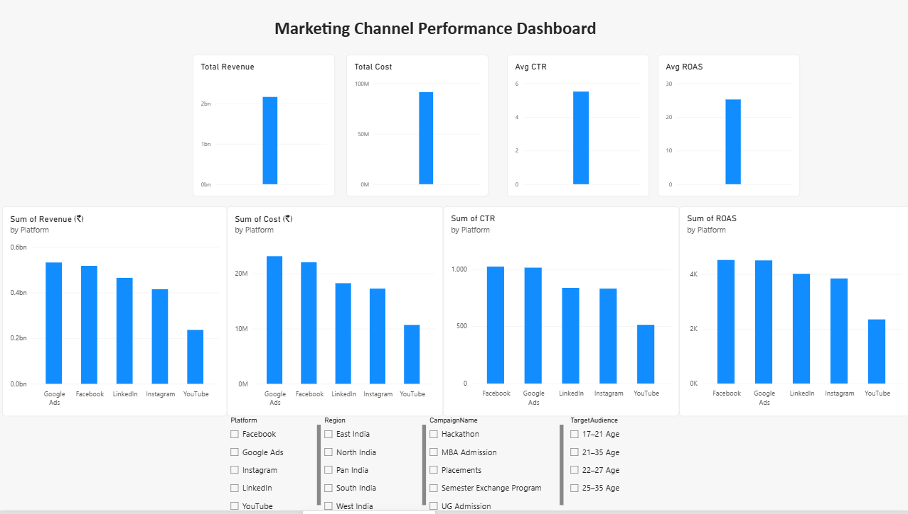

# end-to-end-marketing-campaign-analytics
End-to-end Marketing Campaign Analytics project using Python, PostgreSQL, Excel, and Power BI to analyze campaign performance, marketing channels, revenue, enrollments, CTR, and ROAS.
# End-to-End Marketing Campaign Analytics

## Project Overview

This project demonstrates a complete Marketing Campaign Analytics workflow using Python, PostgreSQL, Excel, and Power BI.

The objective was to analyze marketing campaign performance across multiple channels, campaigns, regions, and target audience segments to identify high-performing marketing strategies and improve return on advertising spend (ROAS).

The project follows a real-world analytics pipeline from data preparation and SQL analysis to dashboard development and business reporting.

---

## Business Problem

Educational institutions invest significant budgets in digital marketing campaigns to drive student enrollments.

Management requires answers to key business questions:

- Which marketing channels generate the highest revenue?
- Which campaigns produce the most enrollments?
- Which campaigns deliver the best ROAS?
- Which regions perform best?
- Which audience segments respond most effectively?
- How can marketing budgets be optimized?

This project was built to answer those questions through data-driven analysis.

---

## Project Workflow

### 1. Dataset Preparation
- Marketing campaign dataset collected and organized
- Data quality checks performed
- Cleaned dataset prepared for analysis

### 2. Python Analysis
- Data exploration and preprocessing using Python
- Initial analytical review of campaign performance
- Data validation before database loading

### 3. PostgreSQL Analysis
- Campaign data imported into PostgreSQL
- SQL queries used for business analysis
- Revenue, cost, CTR, ROAS, and enrollment metrics evaluated

### 4. Excel Analysis
- Data cleaning and validation
- Pivot Tables
- Pivot Charts
- KPI calculations
- Exploratory business analysis

### 5. Power BI Dashboard Development
Interactive dashboards were created for stakeholder reporting and decision-making.

---

## Dashboards

### Executive Summary
Provides a high-level overview of:

- Total Revenue
- Total Enrollments
- Total Cost
- Average CTR
- Average ROAS
- Revenue by Platform
- Revenue by Region



---

### Campaign Performance Analysis
Analyzes campaign effectiveness through:

- Campaign Revenue
- Campaign Enrollments
- Campaign ROAS


---

### Marketing Channel Performance
Evaluates marketing channel effectiveness using:

- Revenue by Platform
- Cost by Platform
- CTR by Platform
- ROAS by Platform



---

## Key Performance Indicators (KPIs)

- Revenue
- Cost
- Enrollments
- CTR (Click Through Rate)
- ROAS (Return on Ad Spend)

---

## Key Insights

- Google Ads generated the highest revenue among all channels.
- MBA Admission and UG Admission campaigns delivered the strongest performance.
- YouTube contributed the lowest overall revenue.
- ROAS varied significantly across marketing channels.
- Regional performance differences highlighted opportunities for targeted marketing investment.

---

## Tools & Technologies

- Python
- PostgreSQL
- Microsoft Excel
- Power BI

---

## Repository Structure

```text
01_Dataset
02_Python
03_SQL
04_Excel
05_PowerBI
06_Reports
README.md
```

---

## Skills Demonstrated

- Data Cleaning
- Data Analysis
- SQL Querying
- KPI Development
- Marketing Analytics
- Business Intelligence
- Dashboard Design
- Data Visualization
- Reporting & Insights Generation

---

## Author

Mayuresh Kore

Aspiring Data Analyst

Python | SQL | Excel | Power BI
